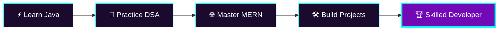

<div align="center">


<a href="https://git.io/typing-svg">

</a>

<br>


</div>

---

# ⚡ SYSTEM STATUS

```yaml
STATUS   : 🟢 ONLINE
MODE     : 📚 LEARNING.exe
FOCUS    : 🎯 STAY CONSISTENT
MISSION  : 🚀 BECOME A SKILLED DEVELOPER
UPTIME   : ∞ (Never Stopped Grinding)
```

---

# 👤 IDENTITY.json

```json
{
  "name": "Vivek N Shetty",
  "role": "CSE Student",
  "class": "MERN Developer [Learning]",
  "subclass": "Java Learner",
  "learning": [
    "Java",
    "Data Structures & Algorithms",
    "MERN Stack"
  ],
  "currently_building": "Real-world projects & problem-solving reflexes",
  "core_directive": "Small daily progress > motivation"
}
```

---

# 🛠 TECH ARSENAL

<div align="center">


</div>

---

# 🎯 ACTIVE QUESTS

```text
📚 Data Structures & Algorithms (Java)
🌐 MERN Stack Development
🛠 Building Real-World Projects
🧠 Problem Solving & Logic Building
```

---

# 📊 GITHUB ANALYTICS

<div align="center">


</div>

<div align="center">


</div>

---

# 🏆 UNLOCKED TROPHIES

<div align="center">


</div>

---

# 🚀 ROADMAP



---

# 🌟 FEATURED BUILDS

<div align="center">

<a href="https://github.com/viveknshetty24-rgb/REPO-NAME-1">

</a>

<a href="https://github.com/viveknshetty24-rgb/REPO-NAME-2">

</a>

</div>

---

# 🤝 CONNECT WITH ME

<div align="center">

<a href="https://www.linkedin.com/in/YOUR-LINKEDIN">

</a>

<a href="mailto:YOUR-EMAIL@example.com">

</a>

<a href="https://github.com/viveknshetty24-rgb">

</a>

</div>

---

# 💡 QUOTE.exe

> **Small progress every single day beats motivation.**

---

<div align="center">


</div>
