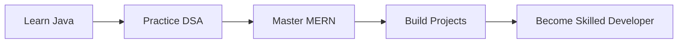

<p align="center">

</p>

<h2 align="center">
🚀 CSE Student • MERN Developer (Learning) • Java Learner
</h2>

<p align="center">
<i>Building projects • Improving Logic • Learning Every Day</i>
</p>

<p align="center">


</p>

---

# ⚡ SYSTEM STATUS

<p align="center">

```yaml
━━━━━━━━━━━━━━━━━━━━━━━━━━━━━━━━━━━━━━

STATUS   : 🟢 ONLINE
MODE     : 📚 LEARNING
FOCUS    : 🎯 STAY CONSISTENT
MISSION  : 🚀 BECOME A SKILLED DEVELOPER

━━━━━━━━━━━━━━━━━━━━━━━━━━━━━━━━━━━━━━
```

</p>

---

# 🎯 CURRENT QUESTS

```text
━━━━━━━━━━━━━━━━━━━━━━━━━━━━━━━━━━━━━━

📚 Data Structures & Algorithms using JAVA

🌐 MERN Stack Development

🛠 Building Real-World Projects

🧠 Problem Solving & Logic Building

━━━━━━━━━━━━━━━━━━━━━━━━━━━━━━━━━━━━━━
```

---

# 🛠 TECH STACK

<p align="center">


</p>

---

# 📊 GITHUB ANALYTICS

<p align="center">


</p>

---

# 🔥 CONTRIBUTION STREAK

<p align="center">


</p>

---

# 📡 DEVELOPER LOG

```bash
$ boot developer_profile

✔ Learning Java
✔ Learning MERN Stack Development
✔ Practicing DSA
✔ Improving Knowledge Daily

Status : Progressing...
```
---

# 🚀 CURRENT ROADMAP



---

# 📈 PROGRESS

```text
Java                ███████░░░ 70%

DSA                 █████░░░░░ 50%

MERN                ████░░░░░░ 40%

Projects            ███░░░░░░░ 30%

Consistency         ██████████ 100%
```

---

<p align="center">

### 💡 Quote of the Day

> **"Small progress every single day beats motivation."**

</p>

---

<p align="center">


</p>
